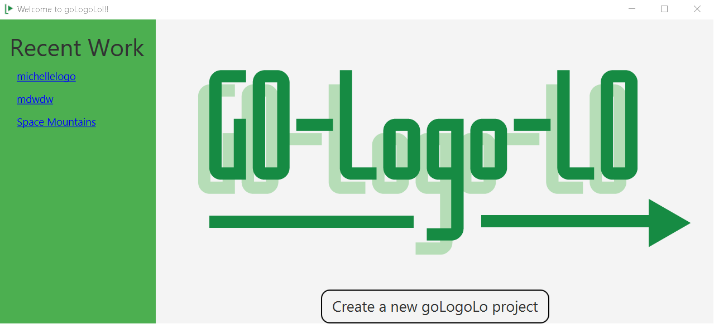
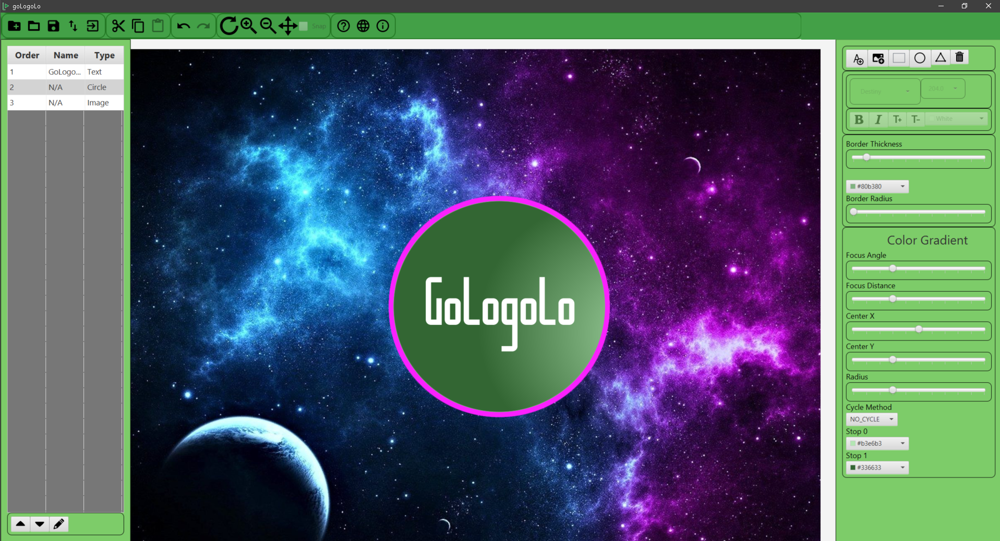

# GoLogoLo
Java Desktop Logo Maker application built using JavaFx, XML and the Desktop Java Framework and includes functionality to create shapes, text, image importing and gradient coloring. Application includes an option to export your logo as a .png file for web usage.

